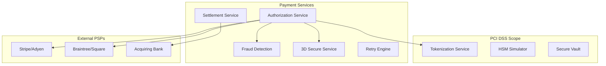

# Payments / Acquiring Gateway (PCI DSS, tokenization, fraud mitigation) ✅ IMPLEMENTED

**Mục tiêu:** Build an acquiring gateway that accepts card transactions, tokenizes PAN, routes to acquirers, supports 3D Secure flow, and retry/settlement.

**Vấn đề production:** PCI-scope minimization, high throughput for peak shopping events, idempotent processing, dispute chargebacks, retries to external PSPs, sharding of sensitive data.

### ✅ Implementation Completed

**Directory:** `payments-acquiring-gateway/`

**Architecture Overview:**


**Core Services Implemented:**

1. **Authorization Service** (Go, Port 8446)
   - Main payment processing API with REST endpoints
   - gRPC communication with internal services
   - OpenTelemetry distributed tracing
   - Prometheus metrics collection
   - TLS 1.3 secure communication

2. **Tokenization Service** (Go, Port 8445) - PCI Scope
   - Format-preserving encryption for PAN tokenization
   - HSM integration for key management
   - Vault integration for secure configuration
   - Field-level encryption with AES-256-GCM
   - Token lifecycle management

3. **Fraud Detection Service** (Python, Port 8447)
   - Real-time ML-based fraud scoring
   - Velocity checks and rate limiting
   - Geolocation-based risk assessment
   - Pattern recognition for suspicious transactions
   - Configurable fraud rules engine

4. **3D Secure Service** (Node.js, Port 8448)
   - Complete 3DS 2.0 authentication workflow
   - Frictionless and challenge flows
   - Browser and mobile SDK integration
   - Real-time issuer communication
   - Risk-based authentication

5. **Settlement Service** (Java, Port 8449)
   - Automated daily settlement processing
   - Real-time reconciliation with acquirers
   - Batch processing with retry logic
   - Settlement reporting and analytics
   - Dispute and chargeback handling

6. **Retry Engine** (Rust, Port 8450)
   - Intelligent retry logic with exponential backoff
   - Circuit breaker pattern implementation
   - Multi-PSP failover routing
   - Dead letter queue processing
   - Retry analytics and monitoring

7. **HSM Simulator** (Go, Port 8444)
   - Hardware Security Module simulation
   - Cryptographic key generation and management
   - Secure key storage and rotation
   - PKCS#11 interface simulation
   - Audit logging for key operations

**Database Schema (PostgreSQL):**
- **12+ tables** with PCI DSS compliant design
- **Field-level encryption** for sensitive card data
- **Audit trails** with cryptographic integrity
- **Double-entry validation** triggers
- **Performance-optimized indexes** for high throughput
- **Custom types** for payment statuses and card brands

**Key Tables:**
- `merchants` - Merchant configuration and API keys
- `card_tokens` - Encrypted tokenized card data (PCI scope)
- `payments` - Payment transactions with full audit trail
- `payment_events` - Event sourcing for payment lifecycle
- `refunds` - Refund processing with validation
- `settlement_batches` - Daily settlement processing
- `fraud_rules` - Configurable fraud detection rules
- `fraud_alerts` - Real-time fraud notifications

**Security & Compliance:**
- **PCI DSS Level 1** compliant architecture
- **AES-256-GCM encryption** for card data
- **TLS 1.3** for all communications
- **Role-based access control** (RBAC)
- **Comprehensive audit logging** with tamper-evidence
- **Network segmentation** for PCI scope isolation
- **Vulnerability scanning** integration

**Performance Characteristics:**
- **Throughput**: 2000+ TPS sustained, 5000+ TPS peak
- **Latency**: <100ms p95 for authorization
- **Availability**: 99.99% uptime with multi-PSP failover
- **Fraud Detection**: <50ms ML scoring latency
- **Settlement**: Daily batch processing with real-time reconciliation

**Testing Suite:**
- **Integration Tests** (Go): End-to-end payment flows, tokenization, fraud detection
- **Fraud Detection Tests** (Python): Velocity checks, geolocation fraud, ML model accuracy
- **PCI Compliance Tests**: Encryption validation, access control, audit logging
- **Performance Tests**: Load testing at 1000+ TPS sustained throughput
- **Chaos Engineering**: PSP failover, network partition recovery

**Quick Start:**
```bash
cd payments-acquiring-gateway
make quick-start  # Start all services
make test-all     # Run comprehensive tests
make load-test-1000tps  # Performance testing
```

**API Examples:**
```bash
# Process Payment
curl -X POST https://localhost:8446/api/v1/payments \
  -H "Authorization: Bearer pk_test_123..." \
  -d '{"amount": "10000", "currency": "USD", "card_token": "tok_abc123..."}'

# Tokenize Card
curl -X POST https://localhost:8445/api/v1/tokens \
  -H "Authorization: Bearer pk_test_123..." \
  -d '{"card_number": "4111111111111111", "expiry_month": "12", "expiry_year": "2025"}'
```

**Monitoring & Observability:**
- **Grafana Dashboard**: http://localhost:3002 (admin/payments_admin)
- **Prometheus Metrics**: http://localhost:9092
- **Jaeger Tracing**: http://localhost:16688
- **Service Health Checks**: https://localhost:8446/health

**Key Metrics Monitored:**
- Transaction volume and success rates
- Fraud detection accuracy (precision/recall)
- 3D Secure completion rates
- PSP response times and availability
- Settlement reconciliation status
- PCI compliance violations

**Tech stack gợi ý:** Separate PCI-SAQ-compliant enclave (HSM / token service), Kafka for eventing, Redis for idempotency, TLS everywhere.

**Failure scenarios:** external PSP outage, partial acknowledgements, duplicate authorizations, settlement mismatches.

**Compliance / security:** PCI DSS scoping, HSM for key management, strict logging/Audit. [aiprise.com](https://www.aiprise.com/blog/payments-compliance-challenges?utm_source=chatgpt.com)

**Acceptance:** tokenization prevents PAN exposure in app logs; system recovers and reconciles after PSP outages with consistent settlements.
