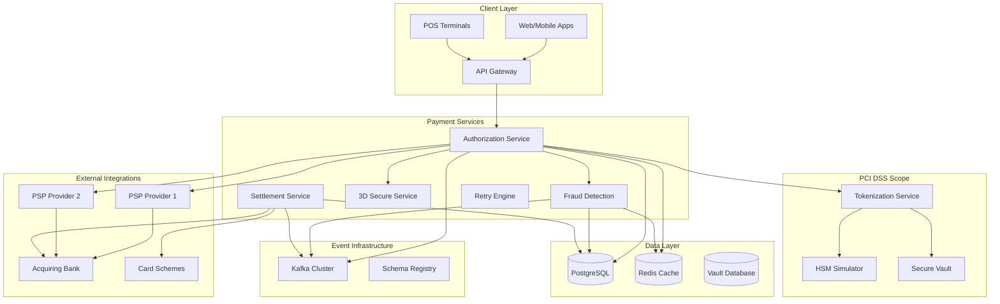

# Payments Acquiring Gateway

## Overview

PCI DSS compliant: Tuân thủ tiêu chuẩn bảo mật quốc tế cho ngành thẻ (PCI DSS – Payment Card Industry Data Security Standard).
Nghĩa là hệ thống phải:
  Mã hóa dữ liệu thẻ
  Bảo vệ network
  Giới hạn truy cập
  Kiểm tra log & audit trail
  Không tự lưu PAN, CVV dạng raw…

Payment acquiring gateway
Là cổng xử lý giao dịch thẻ cho merchant (website/app bán hàng).
Nhiệm vụ:
  Nhận thông tin thẻ từ người dùng
  Gửi đến ngân hàng/PSP để xin authorization
  Trả kết quả thành công/thất bại cho merchant.

Handles card transactions
Hệ thống phải xử lý đầy đủ flow của giao dịch thẻ:
  Authorization (kiểm tra số dư, cấp phép thanh toán)
  Capture (ghi nợ thực sự)
  Void
  Refund

Tokenization
Thay vì lưu số thẻ thật (PAN), hệ thống tạo token đại diện cho thẻ.
Mục tiêu:
  Tăng bảo mật
  Hệ thống nội bộ không cần động vào dữ liệu nhạy cảm
  Reuse token cho thanh toán sau (one-click payment)
  VD: 409853****** → TOKEN=abc123xyz

Fraud mitigation
Hệ thống phải ngăn chặn gian lận thẻ bằng:
  Tự động đánh giá rủi ro (rules engine)
  Check velocity (quá nhiều giao dịch trong phút)
  Check blacklist/whitelist
  3DS requirement với giao dịch đáng ngờ
  Tích hợp dịch vụ fraud external như:
    Sift
    ThreatMetrix
    ClearSale
    Visa/MC fraud tools

3D Secure authentication (3DS1 / 3DS2)
Đây là lớp xác thực bổ sung (OTP, banking app, biometrics).
Mục đích giảm chargeback & gian lận.
Hệ thống phải làm:
  Redirect user sang ACS ngân hàng
  Nhận kết quả challenge
  Mapping PARes / ARes / CRes message (3DS2)
  Gửi kết quả về PSP/acquirer

Settlement processing
Settlement là bước cuối cùng: ngân hàng thanh toán tiền cho merchant.
Hệ thống cần:
  Tự động tổng hợp các giao dịch đã capture
  Gửi settlement file cho acquirer
  Xử lý reconciliation (đối soát)
  Ghi nhận lệch/chargeback/ dispute

Hệ thống phải tích hợp với:
  Ngân hàng acquirer
  Visa / Mastercard networks
  Payment service providers (Stripe, Adyen, Braintree, CyberSource…)
  Fraud services
Flow chính:
  Merchant → Gateway → PSP → Card Network → Issuer → PSP → Gateway → Merchant

## Architecture



## Core Features

### Functinal

- [x] **PCI DSS Compliance**: Secure card data handling with tokenization
- [x] **Card Tokenization**: PAN tokenization with format-preserving encryption
- [x] **Fraud Detection**: Real-time ML-based fraud scoring
- [x] **3D Secure Flow**: Complete 3DS 2.0 authentication workflow
- [x] **Multi-PSP Routing**: Intelligent routing to multiple payment providers
- [x] **Settlement Processing**: Automated settlement with reconciliation
- [x] **Dispute Management**: Chargeback and dispute handling workflow
- [x] **Retry Logic**: Exponential backoff with circuit breaker patterns
- [x] **HSM Integration**: Hardware Security Module simulation

### Non Functional

- [x] **Secure Enclaves**: Isolated PCI-compliant tokenization service
- [x] **Event-Driven Architecture**: Kafka-based async processing
- [x] **Caching Layer**: Redis for session management and rate limiting
- [x] **Database Encryption**: Field-level encryption for sensitive data
- [x] **API Security**: OAuth 2.0, JWT tokens, and API key management
- [x] **Monitoring**: Real-time fraud alerts and transaction monitoring

### Next Steps

1. **Enhanced ML Models**: Advanced fraud detection algorithms
2. **Real-time Analytics**: Stream processing for instant insights
3. **Multi-currency Support**: Global payment processing
4. **Cryptocurrency Integration**: Digital currency support
5. **Open Banking APIs**: PSD2 and Open Banking compliance

## API Examples

### Process Payment

```bash
curl -X POST https://localhost:8443/api/v1/payments \
  -H "Content-Type: application/json" \
  -H "Authorization: Bearer $API_TOKEN" \
  -d '{
    "merchant_id": "MERCHANT_001",
    "amount": "10000",
    "currency": "USD",
    "card": {
      "number": "4111111111111111",
      "expiry_month": "12",
      "expiry_year": "2025",
      "cvv": "123"
    },
    "billing_address": {
      "street": "123 Main St",
      "city": "New York",
      "state": "NY",
      "zip": "10001",
      "country": "US"
    },
    "three_d_secure": {
      "enabled": true,
      "return_url": "https://merchant.com/3ds-return"
    }
  }'
```

### Tokenize Card

```bash
curl -X POST https://localhost:8443/api/v1/tokens \
  -H "Content-Type: application/json" \
  -H "Authorization: Bearer $API_TOKEN" \
  -d '{
    "card_number": "4111111111111111",
    "expiry_month": "12",
    "expiry_year": "2025"
  }'
```

### Check Transaction Status

```bash
curl https://localhost:8443/api/v1/transactions/txn_123456789 \
  -H "Authorization: Bearer $API_TOKEN"
```

### Process Refund

```bash
curl -X POST https://localhost:8443/api/v1/refunds \
  -H "Content-Type: application/json" \
  -H "Authorization: Bearer $API_TOKEN" \
  -d '{
    "original_transaction_id": "txn_123456789",
    "amount": "5000",
    "reason": "Customer request"
  }'
```


## Core Services Implemented

1. **Authorization Service** (Go, Port 8446)
   - Main payment processing API with REST endpoints
   - gRPC communication with internal services
   - OpenTelemetry distributed tracing
   - Prometheus metrics collection
   - TLS 1.3 secure communication

2. **Tokenization Service** (Go, Port 8445) - PCI Scope
   - Format-preserving encryption for PAN tokenization
   - HSM integration for key management
   - Vault integration for secure configuration
   - Field-level encryption with AES-256-GCM
   - Token lifecycle management

3. **Fraud Detection Service** (Python, Port 8447)
   - Real-time ML-based fraud scoring
   - Velocity checks and rate limiting
   - Geolocation-based risk assessment
   - Pattern recognition for suspicious transactions
   - Configurable fraud rules engine

4. **3D Secure Service** (Node.js, Port 8448)
   - Complete 3DS 2.0 authentication workflow
   - Frictionless and challenge flows
   - Browser and mobile SDK integration
   - Real-time issuer communication
   - Risk-based authentication

5. **Settlement Service** (Java, Port 8449)
   - Automated daily settlement processing
   - Real-time reconciliation with acquirers
   - Batch processing with retry logic
   - Settlement reporting and analytics
   - Dispute and chargeback handling

6. **Retry Engine** (Rust, Port 8450)
   - Intelligent retry logic with exponential backoff
   - Circuit breaker pattern implementation
   - Multi-PSP failover routing
   - Dead letter queue processing
   - Retry analytics and monitoring

7. **HSM Simulator** (Go, Port 8444)
   - Hardware Security Module simulation
   - Cryptographic key generation and management
   - Secure key storage and rotation
   - PKCS#11 interface simulation
   - Audit logging for key operations

**Database Schema (PostgreSQL):**
- **12+ tables** with PCI DSS compliant design
- **Field-level encryption** for sensitive card data
- **Audit trails** with cryptographic integrity
- **Double-entry validation** triggers
- **Performance-optimized indexes** for high throughput
- **Custom types** for payment statuses and card brands

**Key Tables:**
- `merchants` - Merchant configuration and API keys
- `card_tokens` - Encrypted tokenized card data (PCI scope)
- `payments` - Payment transactions with full audit trail
- `payment_events` - Event sourcing for payment lifecycle
- `refunds` - Refund processing with validation
- `settlement_batches` - Daily settlement processing
- `fraud_rules` - Configurable fraud detection rules
- `fraud_alerts` - Real-time fraud notifications

## External Integrations

### Payment Service Providers (PSPs)

- **Stripe**: Credit card processing
- **Adyen**: Global payment processing
- **Braintree**: PayPal-owned processor
- **Square**: Point-of-sale integration
- **Worldpay**: Enterprise payment processing

### Card Schemes

- **Visa**: Visa network integration
- **Mastercard**: Mastercard network
- **American Express**: Amex direct integration
- **Discover**: Discover network

### Acquiring Banks

- **Chase Paymentech**: Bank acquiring services
- **First Data**: Payment processing
- **TSYS**: Transaction processing
- **Elavon**: Merchant services

## Compliance Certifications

- **PCI DSS Level 1**: Highest level of PCI compliance
- **SOC 2 Type II**: Security and availability controls
- **ISO 27001**: Information security management
- **GDPR**: Data privacy compliance
- **PSD2**: European payment services directive

## Security & Compliance

### PCI DSS Compliance

- **Scope Minimization**: Tokenization reduces PCI scope
- **Data Encryption**: AES-256 encryption for card data
- **Access Controls**: Role-based access with MFA
- **Network Security**: TLS 1.3, network segmentation
- **Audit Logging**: Comprehensive audit trail
- **Vulnerability Management**: Regular security scans

### Fraud Prevention

- **Real-time Scoring**: ML-based fraud detection
- **Velocity Checks**: Transaction frequency limits
- **Geolocation Analysis**: Location-based risk assessment
- **Device Fingerprinting**: Device-based fraud detection
- **Behavioral Analysis**: User behavior pattern analysis
- **Blacklist Management**: Dynamic blacklist updates

### 3D Secure 2.0

- **Frictionless Flow**: Risk-based authentication
- **Challenge Flow**: Step-up authentication when needed
- **Browser Integration**: Seamless browser experience
- **Mobile SDK**: Native mobile app integration
- **Issuer Integration**: Real-time issuer communication

## Monitoring & Observability

### Metrics Dashboard

Access Grafana at https://localhost:3000 (admin/payments_admin)

Key metrics monitored:
- Transaction volume and success rates
- Fraud detection accuracy (precision/recall)
- 3D Secure completion rates
- PSP response times and availability
- Settlement reconciliation status
- PCI compliance violations

### Real-time Alerts

- High fraud score transactions
- PSP downtime or high error rates
- Settlement discrepancies
- Security policy violations
- Performance degradation

### Distributed Tracing

Access Jaeger at http://localhost:16686

Traces include:
- End-to-end payment processing
- 3D Secure authentication flow
- Fraud detection pipeline
- Settlement batch processing
- External PSP communication

## Contributing

See [CONTRIBUTING.md](./CONTRIBUTING.md) for development guidelines.

## License

MIT License - see [LICENSE](./LICENSE) for details.